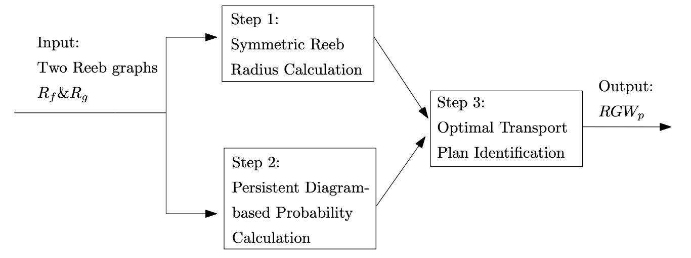

# Gromov-Wasserstein Distance for Reeb Graphs

This repository implements the Gromov-Wasserstein distance (GW) for comparing Reeb graphs。 This method integrates topological and geometric features of Reeb graphs, providing a robust framework for their comparison. Key innovations include the Symmetric-Reeb radius and persistence diagram-based Borel probabilities.

---

## Overview

Reeb graphs represent the topological evolution of scalar fields. Traditional comparison metrics are often computationally intensive or fail to capture significant features. Our RGWp-based approach offers:

- **Symmetric-Reeb Radius**: Resolves asymmetry issues in traditional metrics.
- **Persistence Diagram-Based Probabilities**: Focuses on topologically critical features.
- **Polynomial Time Complexity**: Suitable for large-scale applications.

### Workflow

1. Compute the Symmetric-Reeb radius between nodes.
2. Assign persistence diagram-based Borel probabilities.
3. Calculate the optimal transport plan and RGWp distance.



---

## Installation

1. Clone this repository:
   ```bash
   git clone https://github.com/gm3g11/Gromov-Wasserstein-distance-on-Reeb-graphs.git
   cd Gromov-Wasserstein-distance-on-Reeb-graphs

