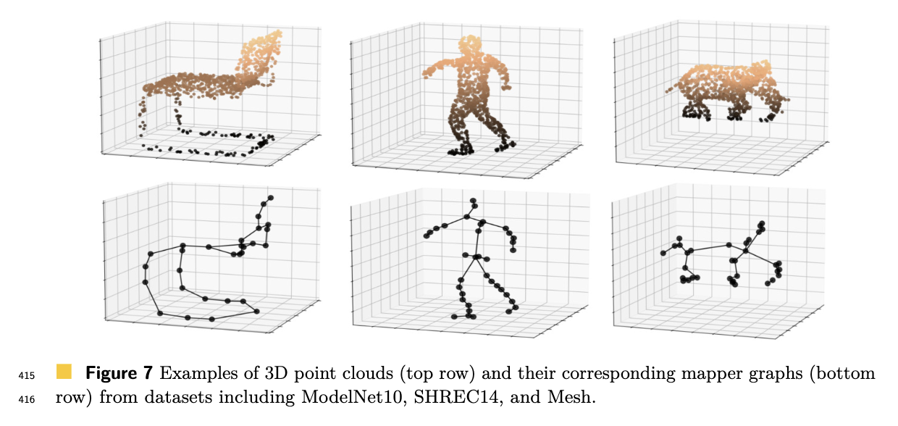

# Gromov-Wasserstein Distance for Reeb Graphs

This repository implements the Gromov-Wasserstein distance (GW) for comparing Reeb graphs。 This method integrates topological and geometric features of Reeb graphs, providing a robust framework for their comparison. Key innovations include the Symmetric-Reeb radius and persistence diagram-based Borel probabilities.

---

## Overview

Reeb graphs represent the topological evolution of scalar fields. Traditional comparison metrics are often computationally intensive or fail to capture significant features. Our RGWp-based approach offers:

- **Symmetric-Reeb Radius**: Resolves asymmetry issues in traditional metrics.
- **Persistence Image-Based Probabilities**: Focuses on topologically critical features.
- **Polynomial Time Complexity**: Suitable for large-scale applications.

### Workflow

1. Compute the Symmetric-Reeb radius between nodes.
2. Assign persistence diagram-based Borel probabilities.
3. Calculate the optimal transport plan and RGWp distance.


---

## Installation
Clone this repository:
   ```bash
   git clone https://github.com/gm3g11/Gromov-Wasserstein-distance-on-Reeb-graphs.git
   cd Gromov-Wasserstein-distance-on-Reeb-graphs
   ```
---

## Example

The example code includes the entire workflow to calculate GWD between two Reeb graphs:
```bash
python Prpposed_Gromov_Wasserstein_distance_between_two_Reeb_graphs_with_Persistent_Image.ipynb
```
---

## Usage



For the real application (including the Reeb graph construction on the 3D point cloud), use the following command:
   ```bash
   cd code
   python SHREC_propose.py
   python modelnet10_propose.py
   python meshe_propose.py
   ```
---

## Ablation Study
The "code" folder also includes the compared methods: DRG, bottleneck distance, and (approximate) Graph Edit Distance (GED) on different datasets. It also contains the code for the ablation study:
```bash
cd code
python SHREC_propose_ablation.py
```

## Hyperparameter Analysis
In our proposed $RGW_p$ method, the primary hyperparameters are inherited from the Persistence Image (PI) construction. These three key parameters are: the Gaussian kernel bandwidth ($\sigma$), the PI grid resolution ($N$), and the weighting power ($w_p$) applied to persistence values. We also conduct sensitivity analysis of these three hyperparameters across our test datasets.
```bash
python sensitivity_anlysis.py
```


